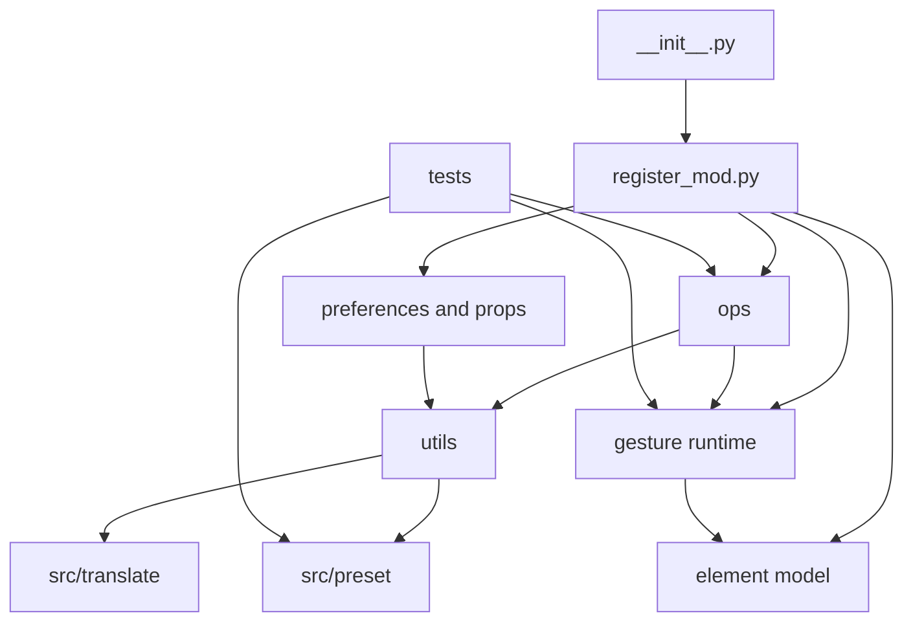

# Gesture Helper Project Context

## Purpose

Gesture Helper is a Blender 4.2+ Extension and legacy-compatible add-on that
lets users bind gestures, persistent menus, Blender operators, and RNA property
actions to configurable keymaps. The extension manifest is at the repository
root; `__init__.py` retains `bl_info` for legacy loading.

## Architecture

- `__init__.py` delegates registration to `register_mod.py`.
- `preferences/` and `props.py` define Add-on Preferences and editor state.
- `gesture/` owns gesture data, keymaps, input/session handling, drawing, and
  persistent-menu runtime.
- `element/` implements nested gesture elements: conditions, child gestures,
  operators, properties, dividers, and layout containers.
- `ops/` contains editor, import/export, modal, and Quick Add operators.
- `utils/` provides persistence, preset discovery, cache/state, translation,
  property-path, and Blender compatibility helpers.
- `src/preset/`, `src/translate/`, and `src/icons/` ship presets, locale data,
  and assets. `tests/` holds pure-Python and background-Blender smoke tests.

## Key Workflows

- Presets are discovered by `utils/preset.py`; files whose names start with
  `Example ` are debug-only and must exactly match `DEBUG_ONLY_PRESET_NAMES`.
- `Example Practical Menu.json` is the opt-in 3D View menu example. It uses
  mode-aware `CHILD_GESTURE` groups for navigation, viewport display, object,
  and mesh-edit actions; its smoke test checks mesh, non-mesh, and no-object
  menu order.
- Runtime gestures live in the `WindowManager` `SKIP_SAVE` store. `register_mod`
  restores them through external persistence across file-load boundaries.
- Menu rendering is in `gesture/menu.py`. `CHILD_GESTURE` creates submenus;
  `ROW`, `COLUMN`, and `BOX` are layout containers and may be flattened.
- Extension packaging uses `blender_manifest.toml` and the GitHub workflow.
  Agent files and test artifacts must be excluded from release archives.

## Constraints

- Support Blender 4.2+ and current 5.x. Use version-safe UI icon handling.
- Bundled example top-level gestures are opt-in and use an unmodified
  `RIGHTMOUSE` + `PRESS` shortcut. Nested fixture state must not be normalized.
- JSON must be UTF-8 and reject duplicate keys. `operator_properties` is a
  Python-literal dictionary string.
- Conditional `IF` / `ELIF` / `ELSE` elements must be consecutive.
- Dynamic RNA property paths must prove the live owner and remain stable; fail
  closed when collection identity cannot be preserved.
- `preferences/draw_property.py` uses the Chinese default `小萌新` as an
  exported preset author signature, not as default UI copy. Preserve it during
  language QA; manifest maintainers and ordinary source UI remain English.
- Background Blender runs must isolate all `BLENDER_USER_*` directories and
  never terminate an unowned Blender process.

## Verification

```powershell
python -m unittest discover -s tests -p 'test_*.py' -v
python -m ruff check .
python -m compileall -q element gesture ops preferences ui utils tests
git diff --check
```

Run `tests/blender_example_presets_smoke.py` and other affected smoke scripts
on Blender 4.2 and current 5.x with isolated user directories and
`--python-exit-code 1`. Before release, run Blender Extension `validate`,
`build`, inspect the ZIP entries, then validate the generated ZIP.

## Current Risks

- The worktree contains broad user changes; do not reset, revert, or overwrite
  unrelated files.
- Menu and keymap behavior depends on real Blender RNA, poll context, and
  version-specific operators; JSON-only tests are insufficient.
- Modal, cache, handler, and `SKIP_SAVE` lifecycle cleanup is shared runtime
  behavior with a broad regression surface.

## Module Graph


