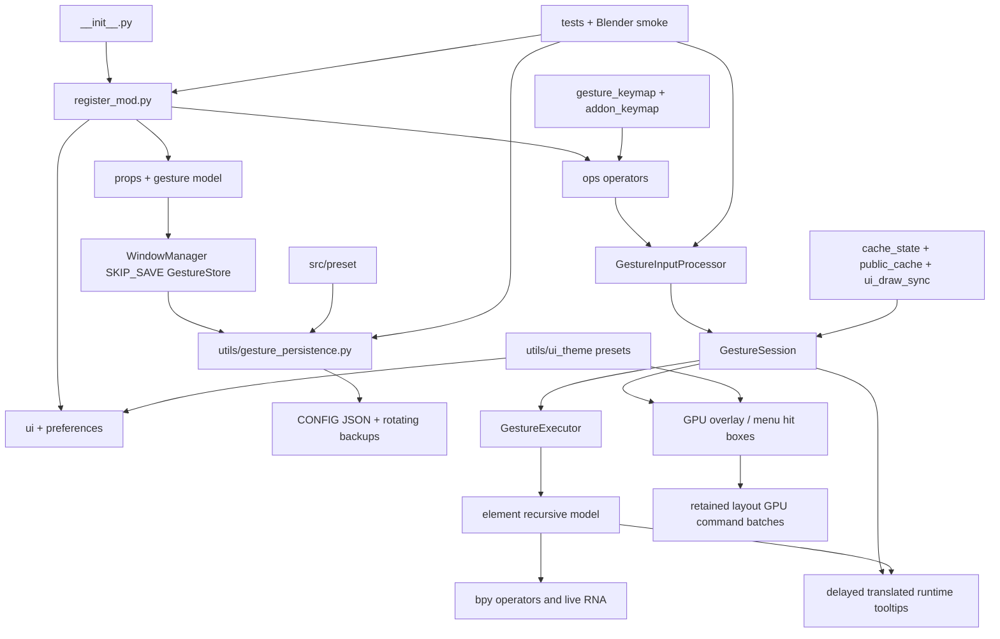

# Gesture Helper Project Context

## Purpose

Gesture Helper is a Blender 4.3+ Extension (also loadable as a legacy add-on)
for binding radial gestures and persistent menus to Blender operators, modal
operators, and RNA property edits. The repository is Python-only at runtime,
with bundled JSON presets, translations, and PNG icon assets.

## Architecture

### Startup and registration

- `__init__.py` exposes Blender's legacy `register`/`unregister` API and
  `bl_info`; `blender_manifest.toml` is the Extension package contract.
- `register_mod.py` registers `ui`, `ops`, `preferences`, `props`, and
  translation classes, installs the `WindowManager.gesture_helper` pointer,
  clears owned keymaps and caches, restores persisted gestures, and installs
  load/playback handlers. Unregister cancels timers, modal/draw handlers,
  saves state, removes keymaps and RNA properties, then unregisters modules.
- `utils/rna_register.py` replaces stale operators, PropertyGroups, panels,
  menus, lists, headers, and preferences during reload. Gesture registration
  compares the complete live `Element.element_type` RNA enum with the source
  declaration and fails immediately instead of importing presets into a stale
  schema.
- `utils/rna_register.py` provides reload-tolerant class registration. The
  package build excludes tests, documentation, VCS files, caches, and agent
  files via `[build].paths_exclude_pattern`.

### Runtime data and persistence

- `gesture/__init__.py` defines the RNA model: `GestureStore` contains a
  `CollectionProperty` of `Gesture`; each `Gesture` contains recursive
  `Element` nodes from `element/__init__.py`. Both live on the WindowManager
  with `SKIP_SAVE`, so they are session state rather than `.blend` DNA.
- `utils/gesture_persistence.py` serializes the store to CONFIG JSON using
  atomic temp-file + `os.replace`, validates the written structure, debounces
  structural saves, migrates legacy AddonPreferences data, and rolls back a
  failed restore. `register_mod` snapshots before file load and restores after
  Blender clears the WindowManager store.
- `utils/property.py` is the generic RNA-to-indexed-dict serializer/importer;
  `ops/export_import.py` validates and sanitizes imported JSON. During strict
  batch assignment, reactive active-gesture and temporary-operator KMI sync is
  deferred until one final shortcut rebuild validates the completed data.
  `utils/strict_json.py` rejects duplicate object keys for gesture imports,
  persistence, preference backups, embedded shortcut JSON, bundled presets,
  and translation catalogs. Keymap data is also strict about scalar shortcut
  fields and unknown fields.

### Input, execution, and drawing flow

1. Blender invokes `ops/gesture.py:GestureOperator` or `ops/menu.py` through
   keymaps managed by `gesture/gesture_keymap.py` and `gesture/addon_keymap.py`.
2. `GestureSession` owns per-modal state, trajectory KD-tree, event snapshot,
   phase/handoff state, property-drag state, proxy identity pool, and timeout
   handles.
3. `utils/input_event.py` defines shared pointer-move semantics so normal and
   in-between Blender samples drive the same gesture, tablet, numeric-drag,
   persistent-menu, and preview paths. `gesture/gesture_input.py` normalizes
   thresholds, direction and hover state; `gesture/gesture_executor.py` chooses
   immediate vs release execution. `element/element_operator.py` invokes operators and modal
   wrappers; `element/element_property.py` resolves and edits live RNA.
   `utils/operator_compat.py` migrates legacy `*_GPENCIL` mode arguments to
   Blender 4.3+ `*_GREASE_PENCIL` identifiers. `object.mode_set` uses its native
   call defaults because forced execution-context/undo overrides are unsafe for
   Grease Pencil modes.
4. `gesture/gesture_draw_gpu.py`, `element/*draw*.py`, and `src/lib` calculate
   GPU geometry and hit boxes. `gesture/menu.py` renders persistent menus;
   `utils/ui_theme.py` owns five coordinated overlay presets (Blender Dark,
   Deep Grey, Minimal Dark, Blender Light, and Maya) plus the user-edited Custom
   state. The same palette drives radial/layout elements, persistent menus,
   preview selectors, and instruction overlays. Pointer interaction is kept
   separate from semantic selection/value state: actionable surfaces have
   distinct normal, hover, pressed, and disabled treatments, selector actions
   activate on release over the original row, and a release after leaving the
   row cancels activation.
   The radial direction cue begins halfway between its center and inner ring,
   then eases its radius, sweep, opacity, and stroke weight into confirmation.
   `ROW`, `COLUMN`, `BOX`, and `SPLIT` are layout containers;
   `LABEL` is a non-interactive text/icon layout item; and `CHILD_GESTURE`
   creates nested menus. `SPLIT` follows Blender's native sizing rule:
   factor zero divides columns equally, while a nonzero factor sizes the first
   column and shares the remainder between later columns; split column spacing
   remains present even when its button group is aligned. Layout containers keep Blender's two alignment concepts
   separate: `layout_align` defaults on and removes inter-item spacing;
   `layout_round_corners` independently enables rounded layout and child
   surfaces; and `layout_align_separators` controls whether a separator stays
   inside one adjacent rounded group or breaks it into independently rounded
   runs. A populated aligned BOX remains flush with its child surfaces and
   uses one outer border. Nested layout containers normally own their
   configured four-corner perimeter; when an aligned parent keeps
   divider-separated items in one group, participating nested containers
   inherit that group's exposed corners so divider-adjacent corners stay
   square. `layout_alignment` supports horizontal
   `EXPAND`/`LEFT`/`CENTER`/`RIGHT` item distribution plus
   `TEXT_LEFT`/`TEXT_CENTER`/`TEXT_RIGHT` modes that retain expanded item
   geometry and move only the label inside the space left by icons, status
   markers, numeric arrows, and child-menu chevrons. Gesture and menu
   separators share the same thin stroke metric. Empty layout containers
   measure to zero, are omitted by their parent, and publish no draw or hit
   area. Layout-row hover changes only the background fill (no
   hover outline); property backgrounds and slider fills receive the same
   color blend so their value fraction remains visible.
   Hovering or pressing the value part of a three-part numeric field switches
   its label to the active text color, and the interaction fill is submitted
   below the label so the value remains legible. Edge-arrow interaction changes
   only that edge block and chevron, leaving the middle value surface and text
   unchanged.
   Holding Alt while changing a runtime `object` or `object.data` property
   copies the resulting value to the matching writable property on every
   selected editable object; cancelling an Alt numeric scrub restores each
   target's original value.
   `gesture/runtime_tooltip.py` owns delayed hover fade-in/fade-out state and
   short-lived redraw timers; `element/element_tooltip.py` builds translated
   operator/property metadata and independent status/icon diagnostics. RNA
   property labels, descriptions, and enum values honor the property's explicit
   `translation_context`; compatibility scanning is used only when no property
   context is available, while operator metadata retains its cross-context
   lookup for Blender-version catalog differences. Tooltip
   timers are cancelled on target changes, modal reset/exit, and unregister.
   While a runtime tooltip is visibly displayed, Ctrl+C copies its complete
   content to Blender's clipboard and reports the result. Radial numeric
   directions select only; numeric changes require a wheel event or explicit
   left-mouse drag. Hovered scalar numeric and boolean rows reset to their RNA
   defaults on Backspace in both radial/layout gestures and persistent menus.
   Read-only radial previews enter `UI_VISIBLE` immediately (without the
   gesture timeout or trajectory overlay); menu previews use the dedicated
   `GestureMenuRuntime` draw handler and a menu-specific area lookup so the
   unified preview's radial GPU base cannot shadow its draw routing. Plain
   Space-drag or left-dragging a menu title converts a centered menu preview
   to a movable anchored preview. The preview selector's complete backplate is
   draggable with an independent persisted-in-session offset, while its
   gesture rows and close button retain click priority. Read-only gesture,
   menu, and element previews use the normal Blender UI scale and retain the
   live overlay palette.
   Radial and menu gesture previews share the compact translated selector and
   viewport instruction HUD; the menu backend initializes, draws, and routes
   selector input through its own handler before menu hit testing. Its compact
   selector uses an unframed Select Gesture label followed by an X close button
   at the far right of the top row; hovering the X shows a localized Close
   Preview tooltip. The selector alone scales its fixed metrics by 1.2; gesture
   rows fill the available selector width, and inactive row backgrounds use 0.1
   of their normal alpha while hover/pressed colors remain unchanged. Its
   batched SDF shader performs the same sRGB-to-framebuffer conversion as the
   other gesture GPU primitives, so every selector surface matches the active
   overlay theme. The instruction HUD starts inside the View3D top-left corner
   and its complete surface can be dragged with a session-only offset. Radial
   previews retain the static
   point/line history when entering child gestures while still suppressing the
   live mouse trail. Selector hover events do not consume Space-drag navigation.
   Large layout previews cache static measurements, cull off-screen subtrees,
   publish only token-current visible hit rows, and resolve each visible row's
   status, label, icon, and display metrics once per draw. Stable top-level
   layouts without live property displays additionally retain one frame of GPU
   commands: rounded fills are precompiled into one colored batch, matching
   polyline styles are grouped, and unchanged frames replay the commands while
   restamping visible rows with the new layout token. The complete cache key
   covers structure/content and poll generations, locale, style, hover/press
   state, owner-region size, and the model-view matrix. Blender element identity
   uses `as_pointer()` so rebuilt RNA wrappers cannot reuse stale Python-id cache
   entries. Dynamic property layouts keep the immediate renderer, and flyouts
   flush at explicit stacking boundaries.
   Numeric `INT`/`FLOAT` property rows are always painted as three contiguous
   Blender-style blocks: decrement, value, and increment, when Blender's global
   Numeric Input Arrows preference is enabled. The three blocks have
   independent normal, hover, and pressed feedback: edge clicks step, the
   value region scrubs or invokes property editing, and wheel input steps
   hovered values without leaking through a persistent menu to the editor.
   During a numeric scrub the pointer is hidden through Blender's modal-cursor
   API, the pressed value surface exclusively owns hover/tooltip state, and all
   finish, cancel, deactivation, exception, and teardown paths restore the
   previous cursor. A menu-started LMB scrub commits and restores on release;
   gesture handoff still ignores stale release events. The gesture operator
   requests Blender's `GRAB_CURSOR` behavior, so Continuous Grab supplies native
   virtual mouse coordinates instead of letting the hidden pointer stop at a
   screen edge. At a numeric soft/hard limit, the discarded pointer overshoot
   rebases the drag start so reversing direction responds immediately.
   The soft RNA range owns the slider fraction and normal interaction bounds;
   the hard range remains the absolute assignment bound. Linear float dragging
   follows Blender's native number-button scale (`RNA step * 0.01` per pixel,
   with Shift precision); integer dragging uses Blender's three soft-range pixel
   bands. Values outside declared soft limits expand the live interaction range
   to Blender's rounded 1/2/5-by-power-of-ten boundary without exceeding the
   hard range. The slider fill is clipped to the middle value block and never
   paints beneath the decrement/increment blocks.
   Persistent-menu rows use the panel background in their idle state and meet
   adjacent rows without an inset; internal row corners are square, while only
   the exposed panel perimeter remains rounded. Numeric fields use the complete
   row surface; their three internal part boundaries remain square, while an
   exposed field edge inherits the panel perimeter corners. Edge chevrons scale
   with row height.
   A radial numeric root still uses its complete item bounds,
   including the configured text margin, as that three-part field; it has no
   separate wrapper or inset numeric surface. Read-only numeric rows suppress
   the arrows.
   Persistent-menu enum rows show the translated current value in a dropdown
   control; clicking it opens a Blender-style flyout with radio-marked choices,
   and selecting a choice updates the live RNA value and collapses the flyout.
   Persistent menu boolean rows use Blender-style left checkboxes when their
   per-property State Icons option is enabled, or hover-only feedback when it
   is disabled; nonnumeric rows use type badges.
   Aligned layout separators consume only their visible line height, so they
   no longer introduce hidden vertical spacing. Ordinary bottom-extension rows
   also publish their current-token hit geometry
   before evaluating draw-time hover, so highlight and delayed tooltip state do
   not disappear when each GPU frame rotates the layout token. A flyout with
   one nonnumeric action uses that row as the complete outer surface, so its
   normal, hover, pressed, outline, and hit bounds do not leave a dark inset
   wrapper around the button.
5. `utils/public_cache.py`, `cache_state.py`, `structure_cache_ops.py`, and
   `utils/ui_draw_sync.py` batch invalidation and freeze panel snapshots during
   modal input/playback. Any entry in `bpy.context.window.modal_operators[:]`
   pauses both the N-panel and Preferences with their full layouts disabled;
   the read-only `wm.gesture_preview` and persistent `wm.gesture_menu` lifecycle
   modals are excluded so those panels remain editable.
   Their headers expose a non-persistent, default-off update override for the
   duration of the modal. Registration resets it to false, and preference
   backup/restore explicitly excludes it. `utils/session_state.py` arbitrates
   preview ownership. Complete gesture-store replacement synchronously releases
   active/frozen selection proxies, relationship dictionaries, and derived LRU
   entries before clearing the RNA `CollectionProperty`; Blender can immediately
   reuse collection pointer identities, so deferring that invalidation until
   the final batched rebuild can make update callbacks resolve destroyed items.
6. `gesture/pass_through/*` handles forwarding to Blender's native keymaps when
   a gesture does not consume the event.
   Runtime keymaps are derived state: `gesture/addon_keymap.py` preserves the
   exact KMI object registry across Python hot reload and removes only those
   registered objects. No operator-id/name-based orphan sweep is performed.

### UI, preferences, and assets

- `preferences/` defines AddonPreferences and editor/drawing/debug/backup
  controls; `ui/` defines lists, menus, context-menu integration, and the
  main sidebar panel. Its registered title appends the current `ADDON_VERSION`,
  and modal pause status is the first header item after that title.
  Automatic backup/restore controls and manual preference export/import live
  on a dedicated Backups preferences page rather than the Property page or
  N-panel. Overlay sizing and color controls live on a dedicated Style
  preferences page and in a default-collapsed Style child of the N-panel. The N-panel child keeps
  the active theme selector in its header so presets can be switched without
  expanding the full style controls.
  Menu gestures expose a default-on Keep Open toggle beside Menu Style; pinned
  menus pass unrelated editor input through, remain visible after their own
  actions, and close explicitly from the title-bar X (or cancel input).
  Persistent-menu registries retain an ordered set of instances per window and
  area, so one shared space-class draw handler renders every open menu from
  oldest to newest. Different gestures may remain open together, but each
  gesture has at most one persistent-menu instance across the process;
  triggering it again cancels a pending close and promotes the existing menu
  without creating another modal owner. Cleanup removes only the matching
  instance and releases the handler after the last menu exits. In overlapping
  geometry, the newest menu owns pointer input; uncovered portions of older
  menus remain interactive, and cancel input closes only the topmost menu.
  Expanded element trees with more than 48 visible descendants use a cached,
  area/root-scoped 32-row page; selection changes reveal their page, while
  explicit page changes are preserved. Layout Gesture Action choices are built
  lazily in a menu instead of as hundreds of controls on every panel draw. The
  Add Element block keeps layout containers (Row/Column/Box) on one row and
  Div/Label/Split plus the two compact menus on a fixed second row; unavailable
  Div/Label cells are disabled in place so relationship changes never reflow
  the controls. The two Layout rows stay tightly aligned as one group, with a
  small vertical gap separating that group from Add item above. Its
  layout-preset menu contains only the general-purpose Panel Column, Toolbar
  Row, and Two Columns templates.
  Gesture preferences include the hover-tooltip delay in milliseconds (300 ms
  by default); runtime tooltip fade timing is fixed and does not persist state.
  `ops/quick_add/` implements context-sensitive creation helpers and previews.
- Ctrl+Alt+Shift on `wm.gesture_add` imports every bundled preset, then
  appends every preset in one strict transaction already ordered as example
  `RADIAL`, example `MENU`, normal `RADIAL`, and normal `MENU`; any schema,
  RNA, or shortcut failure rolls the complete appended batch back. The same
  modifiers on the bundled-preset
  `wm.gesture_import` button transactionally replace the complete gesture
  store with those four groups and roll back to the previous store if strict
  RNA or shortcut validation fails.
- `utils/preset.py` discovers `src/preset/*.json`; the five files beginning
  `Example ` are opt-in debug fixtures grouped as essentials, elements/layout,
  property controls, combined menu examples, and validation states. Every
  example shortcut is registered in both `3D View` and `Object Mode`. Menu style,
  operator-context, and practical viewport examples share one menu gesture,
  with divider rows between the three child sections. The essentials fixture
  combines the basic radial interaction into the complete direction-slots
  example. The elements/layout fixture
  explicitly demonstrates aligned `EXPAND`, `LEFT`, `CENTER`, and `RIGHT`
  layouts with populated child groups, plus a `LABEL` inside a 35/65 `SPLIT`.
  Its complete upper-right layout is
  duplicated at the lower-left radial slot for simultaneous preview. The
  upper-right copy retains its nonuniform example scale and loose alignment;
  the lower-left copy uses normal 1.0 scaling with tight alignment. The curve
  child menu uses the lower direction so both remain independently reachable.
  Boolean property state icons default to the bundled Blender-style
  `CHECKBOX_HLT`/`CHECKBOX_DEHLT` pair. The fixture exposes that pair through
  its `Viewport States` child gesture and
  includes the practical Subdivide modal control in its bottom extension.
  Property modal modes, quick-add actions, and editable displays share one flat
  menu separated by dividers. Coverage tests derive enum contracts from source and also require
  both states of layout alignment, property drag inversion, property value
  visibility, and boolean state icons. `src/translate/` holds locale JSON and translation
  caches; `src/icons/` holds numbered, color, and Blender-derived PNG icons.
- The normal `Common Menu` preset is enabled on `BUTTON4MOUSE` in 19 relevant
  3D View/mode keymaps. Its compact, keep-open menu filters mode and object-type
  sections at runtime and groups viewport display, mode switching, object and
  mesh operations, sculpt/pose actions, camera/light/mesh values, render/tool
  values, and units. `tests/test_common_menu_preset.py` guards its shortcut,
  coverage, serialized arguments, property paths, and Simplified Chinese text.

## Module graph

## Workflows and verification

- Pure tests: `python -m unittest discover -s tests -p 'test_*.py' -v`.
- Syntax: `python -m compileall -q element gesture ops preferences ui utils tests`.
- Lint: `python -m ruff check .`.
- Blender smoke scripts cover preset coverage, complete bundled-preset
  transactional import, PropertyGroup RNA reload/schema refresh, Grease Pencil
  mode execution, UI-theme RNA application,
  selector press/release cancellation, property data paths, import
  rollback/keymaps (including complete replacement after prewarming nested
  relationship, active-selection, and frozen-UI caches), lifecycle/reload,
   dedicated Preferences-page RNA registration,
   preview (including Blender `MOUSEMOVE`/`INBETWEEN_MOUSEMOVE` compatibility,
   menu draw routing,
  translation, the visible X close action, selector scaling/full-width rows,
  top-left instruction-HUD dragging, single-action flyout surface geometry,
  enum flyouts, three-part numeric-field state/hit boxes, selector/backplate
  dragging, alignment RNA, and Space-drag), and
  panel behavior. Run them
  with isolated `BLENDER_USER_CONFIG`, `BLENDER_USER_DATAFILES`,
  `BLENDER_USER_SCRIPTS`, and `BLENDER_USER_EXTENSIONS`, plus `--background
  --python-exit-code 1`. Treat traceback/Python-error text as failure evidence
  even when Blender exits zero.
- Focused example-keymap, selector-close, and numeric-hover verification:
  `tests/blender_keymap_selector_hover_smoke.py`; it explicitly enables and
  restores Blender's numeric-arrow preference instead of assuming its default.
- Common side-button menu RNA, operator arguments, context branches, editable
  values, and exact KMI coverage: `tests/blender_common_menu_smoke.py`.
- Simultaneous persistent-menu registry, one-instance-per-gesture reuse,
  draw-order, overlap ownership, and cleanup smoke:
  `tests/blender_multi_menu_smoke.py`; run it with the same four isolated
  Blender user roots used by the other background smoke scripts.
- Large-panel profile: set `GH_PANEL_AB_AUTOMATION=1`,
  `GH_PANEL_AB_MODE=ELEMENT_PREVIEW`, and `GH_PANEL_AB_ELEMENT_COUNT=300`, then
  run `tests/blender_panel_profile_ab.py` in foreground Blender. In the
  2026-07-29 Blender 5.2 run, the 300-leaf/426-node fixture measured about
  4.40 ms per Element N-panel draw and 2.77 ms per centered GPU-preview callback;
  268 preview draws completed in 5.003 seconds (about 53.6 draws/second) while
  both the `UI` and `WINDOW` regions were requested at 60 Hz. The previous
  non-retained preview baseline was about 32.3 ms per callback and 20.4 redraw
  requests/second.
- Release: run Blender `--command extension validate`, then `extension build`,
  inspect ZIP entries, and validate the produced archive again.
- Previous release-candidate verification on 2026-07-29: 173 Python files compiled in
  memory, 272 unit tests passed, Ruff and `git diff --check` passed, and all 16
  source JSON files passed duplicate-key validation. Nine isolated background
  smoke scripts passed in both Blender 4.3.2 and 5.2.0 LTS with zero
  tracebacks/Python errors. Both CLIs validated source and the 5.2-built ZIP;
  its 344 entries had no duplicates, unsafe paths, forbidden agent/test/cache
  files, `eval`/`exec` calls, or corruption. SHA-256 is
  `5098A577F44CCC3F0F2001620FC7B64D34364E3CBF54BA4B4AB1E389456161D6`.
  The ZIP installed into isolated local Extension repositories, started
  enabled, imported all 11 bundled presets, exposed the current `SPLIT` RNA,
  and disabled cleanly in Blender 4.3 and 5.2.
- Current-tree focused verification for `Common Menu` passed its four structural
  tests and the source duplicate-key check. Its dedicated smoke and the complete
  12-preset transactional import/keymap smoke passed in isolated Blender 4.3.2
  and 5.2.0 LTS profiles. The complete release/build/package suite has not been
  rerun since the previous baseline.

## Current risks and observed issues

1. **Submission asset-license decision remains open:** the bundled
   `CHECKBOX_HLT`/`CHECKBOX_DEHLT` images are declared as Blender-derived GPL
   assets, while the Nick review guidance expects submitted artwork to meet its
   CC0 threshold. Do not change their provenance or license without an explicit
   release decision.
2. **Blender-exit detection depends on Python stack internals:**
   `utils/__init__.py:is_blender_close()` uses `sys._getframe()` and searches for
   an `addon_utils.disable_all` caller. It currently passes lifecycle smoke but
   depends on implementation details that may change in later Blender/Python.
3. **Blender-only behavior remains higher risk than unit coverage:** focused
   example-preset and unified-preview verification, including layout RNA and
   drawing, passes in Blender 4.3.2 and 5.2.0 LTS. The installed 5.2 build has
   previously aborted with a native access violation before Python assertions,
   so native instability may be intermittent. Foreground visual placement,
   multi-window behavior, and file-load restoration still require targeted
   manual checks.
4. **Broad lifecycle surface:** modal timers, GPU draw handlers, playback/load
   handlers, cached RNA proxies, and `SKIP_SAVE` restoration all share cleanup
   paths. Any future change in `register_mod.py`, `gesture_session.py`,
   `gesture_input.py`, or `utils/ui_draw_sync.py` should include a focused
   Blender smoke run and reload/disable verification.
5. **Packaging drift risk:** the CI workflow builds a nested `{id}/` archive
   after Blender's flat build; changes to manifest exclusions or workflow
   layout should be checked by inspecting ZIP entries.
## Constraints

- Support Blender 4.3+ and current 5.x; use version-safe Blender UI icons.
- Preserve bundled example key events and nested fixture state exactly; every
  example shortcut must cover both `3D View` and `Object Mode`.
- JSON is UTF-8; conditional `IF`/`ELIF`/`ELSE` elements must be consecutive.
- Dynamic RNA paths must validate the live owner and fail closed when collection
  identity cannot be preserved.
- Keep the Gesture N-panel Type and menu-style controls on one row, and keep
  Add Element controls at a stable height when `CHILD` is invalid for a leaf.
- Keep the exported preset author signature in `preferences/draw_property.py`
  unchanged; ordinary source UI and manifest text remain English.
- Never include `AGENTS.md`, `PROJECT_CONTEXT.md`, tests, or caches in release
  archives.
