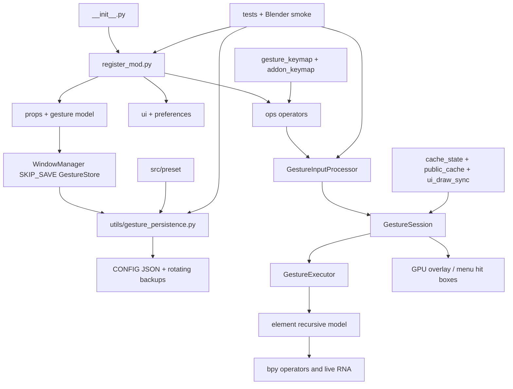

# Gesture Helper Project Context

## Purpose

Gesture Helper is a Blender 4.2+ Extension (also loadable as a legacy add-on)
for binding radial gestures and persistent menus to Blender operators, modal
operators, and RNA property edits. The repository is Python-only at runtime,
with bundled JSON presets, translations, and PNG icon assets.

## Architecture

### Startup and registration

- `__init__.py` exposes Blender's legacy `register`/`unregister` API and
  `bl_info`; `blender_manifest.toml` is the Extension package contract.
- `register_mod.py` registers `ui`, `ops`, `preferences`, `props`, and
  translation classes, installs the `WindowManager.gesture_helper` pointer,
  clears stale keymaps/caches, restores persisted gestures, and installs
  load/playback handlers. Unregister cancels timers, modal/draw handlers,
  saves state, removes keymaps and RNA properties, then unregisters modules.
- `utils/rna_register.py` provides reload-tolerant class registration. The
  package build excludes tests, documentation, VCS files, caches, and agent
  files via `[build].paths_exclude_pattern`.

### Runtime data and persistence

- `gesture/__init__.py` defines the RNA model: `GestureStore` contains a
  `CollectionProperty` of `Gesture`; each `Gesture` contains recursive
  `Element` nodes from `element/__init__.py`. Both live on the WindowManager
  with `SKIP_SAVE`, so they are session state rather than `.blend` DNA.
- `utils/gesture_persistence.py` serializes the store to CONFIG JSON using
  atomic temp-file + `os.replace`, validates the written structure, debounces
  structural saves, migrates legacy AddonPreferences data, and rolls back a
  failed restore. `register_mod` snapshots before file load and restores after
  Blender clears the WindowManager store.
- `utils/property.py` is the generic RNA-to-indexed-dict serializer/importer;
  `ops/export_import.py` validates and sanitizes imported JSON. Keymap data is
  strict (scalar shortcut fields and no unknown fields). Bundled source JSON
  duplicate keys are rejected by tests, but runtime JSON readers currently do
  not enforce that rule (see observed issues).

### Input, execution, and drawing flow

1. Blender invokes `ops/gesture.py:GestureOperator` or `ops/menu.py` through
   keymaps managed by `gesture/gesture_keymap.py` and `gesture/addon_keymap.py`.
2. `GestureSession` owns per-modal state, trajectory KD-tree, event snapshot,
   phase/handoff state, property-drag state, proxy identity pool, and timeout
   handles.
3. `gesture/gesture_input.py` normalizes events, thresholds, direction and
   hover state; `gesture/gesture_executor.py` chooses immediate vs release
   execution. `element/element_operator.py` invokes operators and modal
   wrappers; `element/element_property.py` resolves and edits live RNA.
4. `gesture/gesture_draw_gpu.py`, `element/*draw*.py`, and `src/lib` calculate
   GPU geometry and hit boxes. `gesture/menu.py` renders persistent menus;
   `ROW`, `COLUMN`, and `BOX` are layout containers and `CHILD_GESTURE` creates
   nested menus.
5. `utils/public_cache.py`, `cache_state.py`, `structure_cache_ops.py`, and
   `utils/ui_draw_sync.py` batch invalidation and freeze panel snapshots during
   modal input/playback. Any entry in `bpy.context.window.modal_operators[:]`
   pauses both the N-panel and Preferences with their full layouts disabled;
   the read-only `wm.gesture_preview` modal is excluded for both gesture and
   element preview scopes so those panels remain editable.
   Their headers expose a non-persistent, default-off update override for the
   duration of the modal. Registration resets it to false, and preference
   backup/restore explicitly excludes it. `utils/session_state.py` arbitrates
   preview ownership.
6. `gesture/pass_through/*` handles forwarding to Blender's native keymaps when
   a gesture does not consume the event.

### UI, preferences, and assets

- `preferences/` defines AddonPreferences and editor/drawing/debug/backup
  sub-panels; `ui/` defines lists, menus, context-menu integration, and the
  main sidebar panel. Its registered title appends the current `ADDON_VERSION`,
  and modal pause status is the first header item after that title.
  `ops/quick_add/` implements context-sensitive creation helpers and previews.
- `utils/preset.py` discovers `src/preset/*.json`; files beginning `Example `
  are opt-in debug fixtures. `src/translate/` holds locale JSON and translation
  caches; `src/icons/` holds numbered, color, and Blender-derived PNG icons.

## Module graph

## Workflows and verification

- Pure tests: `python -m unittest discover -s tests -p 'test_*.py' -v`.
- Syntax: `python -m compileall -q element gesture ops preferences ui utils tests`.
- Lint: `python -m ruff check .`.
- Blender smoke scripts cover preset coverage, property data paths, import
  rollback/keymaps, lifecycle/reload, preview, and panel behavior. Run them
  with isolated `BLENDER_USER_CONFIG`, `BLENDER_USER_DATAFILES`, and
  `BLENDER_USER_SCRIPTS`, plus `--background --python-exit-code 1`.
- Release: run Blender `--command extension validate`, then `extension build`,
  inspect ZIP entries, and validate the produced archive again.

## Current risks and observed issues

1. **Runtime JSON accepts duplicate keys:** `ops/export_import.py:479` and
   `utils/gesture_persistence.py:61` use plain `json.load`, so duplicate object
   keys are silently replaced by the last value. Only bundled source files are
   checked with `object_pairs_hook` in tests. This violates the repository's
   strict-JSON constraint and can hide malformed or ambiguous imported data.
2. **Lint failure (reproducible):** `python -m ruff check .` reports `E402`
   at `utils/__init__.py:2` because `import bpy` follows `public_color`.
   This is low-risk behaviorally but blocks a clean lint gate.
3. **Compile verification is environment-blocked:** `compileall` fails to write
   `.pyc` files under both the repository cache and `C:\tmp` with Windows
   `PermissionError`. The 172 passing tests import much of the code without a
   syntax failure, but scripts not imported by those tests remain unverified;
   rerun with a writable bytecode cache outside this restricted environment.
4. **Blender-only behavior remains higher risk than unit coverage:** keymap
   creation, context-sensitive operator polls, RNA collection identity,
   draw-handler/timer cleanup, and file-load restoration require real Blender
   smoke runs on 4.2 and current 5.x. The 172 pure tests cannot prove these.
5. **Broad lifecycle surface:** modal timers, GPU draw handlers, playback/load
   handlers, cached RNA proxies, and `SKIP_SAVE` restoration all share cleanup
   paths. Any future change in `register_mod.py`, `gesture_session.py`,
   `gesture_input.py`, or `utils/ui_draw_sync.py` should include a focused
   Blender smoke run and reload/disable verification.
6. **Packaging drift risk:** the CI workflow builds a nested `{id}/` archive
   after Blender's flat build; changes to manifest exclusions or workflow
   layout should be checked by inspecting ZIP entries.
7. **Local Blender verification unavailable:** no `blender` executable is on
   PATH in the current environment, so background smoke, Extension validation,
   package build, and Blender 4.2/5.x compatibility were not rerun in this
   architecture audit.

## Constraints

- Support Blender 4.2+ and current 5.x; use version-safe Blender UI icons.
- Preserve bundled example preset shortcuts and nested fixture state exactly.
- JSON is UTF-8; conditional `IF`/`ELIF`/`ELSE` elements must be consecutive.
- Dynamic RNA paths must validate the live owner and fail closed when collection
  identity cannot be preserved.
- Keep the exported preset author signature in `preferences/draw_property.py`
  unchanged; ordinary source UI and manifest text remain English.
- Never include `AGENTS.md`, `PROJECT_CONTEXT.md`, tests, or caches in release
  archives.
