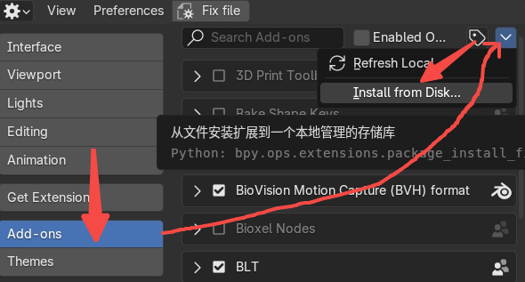
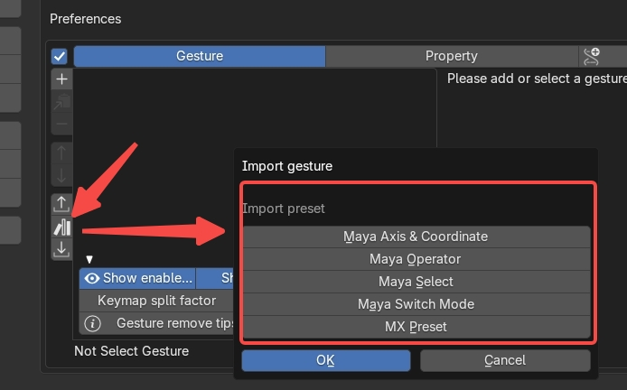
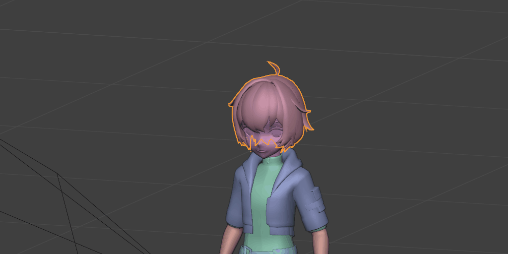
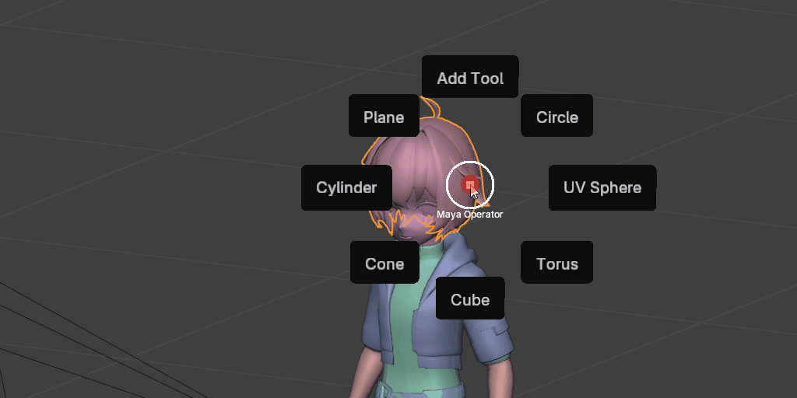
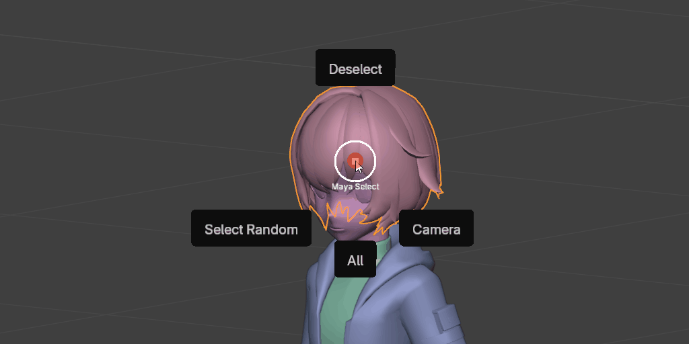
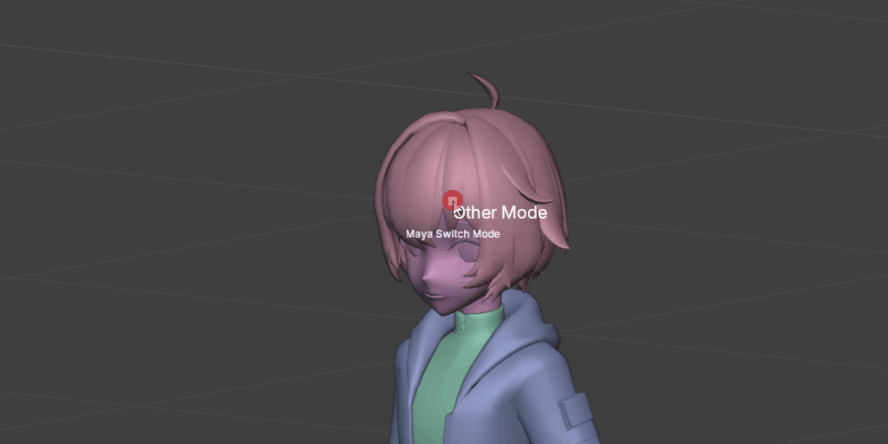
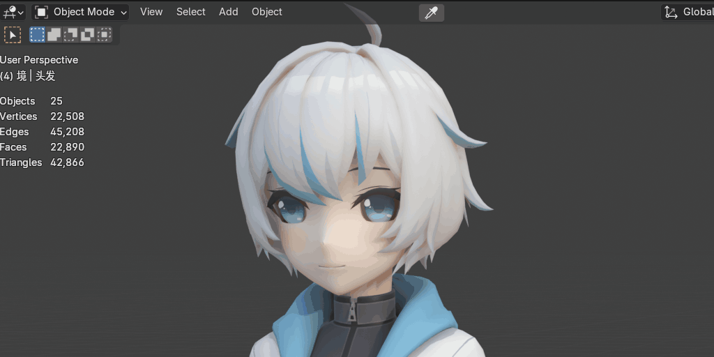
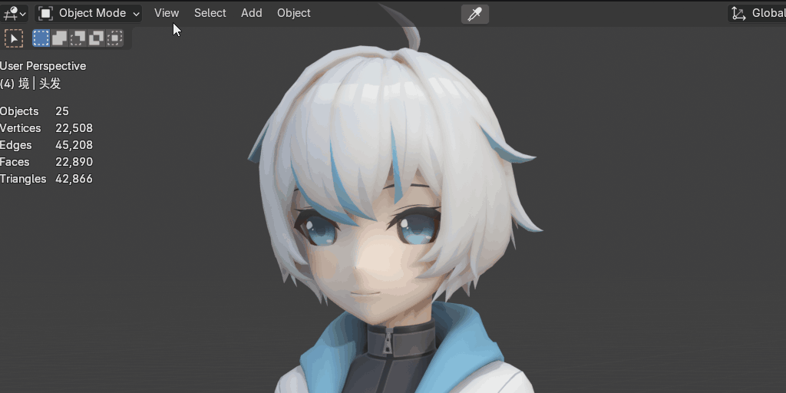
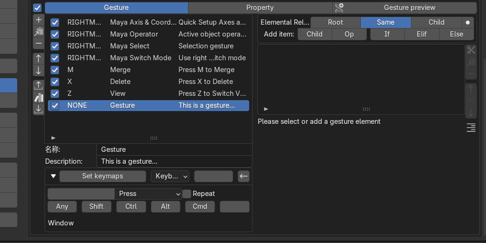

# Gesture Helper

which allows you to quickly use gestures to run the blender operator or change properties.

https://github.com/user-attachments/assets/40e0eeac-7fd7-4a5b-aa2a-21e6b6053ee6

Install:
If it is version 4.2, you can drag the plugin directly into Blender.
Conventional methods:

Simple to use:

* Import Preset

  
    * Maya Axis & Coordinate: Quick Setup Axes and Coordinates
      
    * Maya Operator: Active object operator, each mode displays different content
      
    * Maya Select: Selection gesture
      
    * Maya Switch Mode: Use right click to switch mode
      
    * MX Preset:
      
        * M:Press M to Merge
        * X:Press X to Delete
        * Z:Press Z to Switch View

Gesture:
Keymaps: Select the area where keymap can be triggered    

Element:  
There are three types

* Child: You can set the direction and expand to child when dragging and dropping gestures.
* Operator: operator, either by using bl_idname, or by using a custom script
    * Fast Add Operator: Operator Right-click to add operator
      
    * Fast Add Property: Property Right-click to add property,Supports int, float, string, and enum.
      
* Select Structure:Selection structure, requires some logical thinking, can be conditional on the display of child
  or operators
  

* Property:
  Panel Name: N Panel Name
  Author: Export Data Author
  Name Translation: Translation of the name
